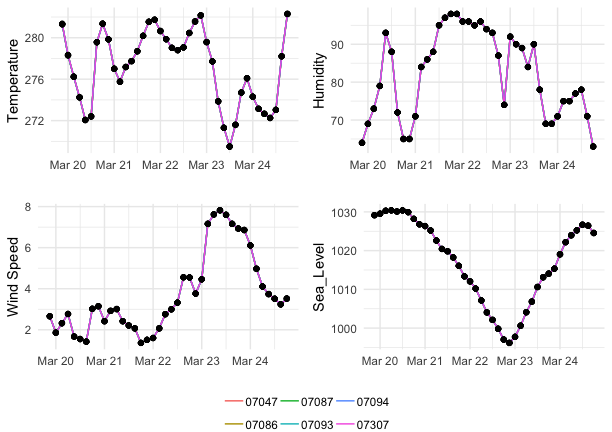
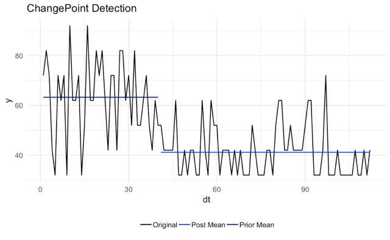
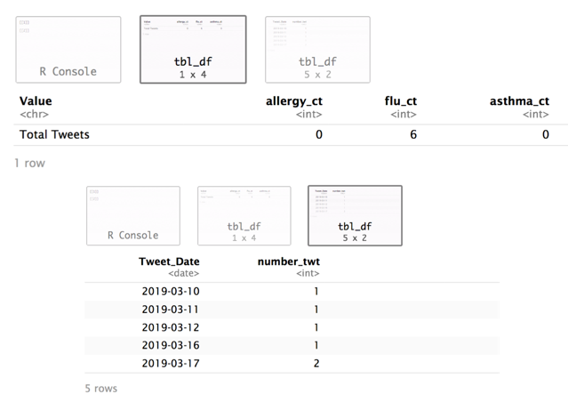
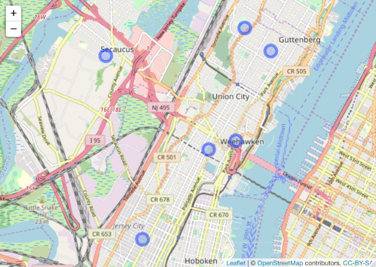
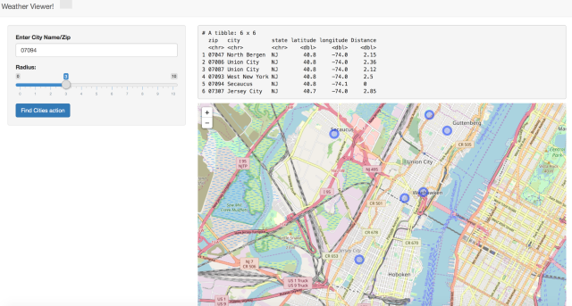

```{r setup, include = FALSE}
knitr::opts_chunk$set(
  collapse = TRUE,
  comment = "#>"
)
```


## Introduction
  The *dcom99.bag9031* package is an OpenWeatherMap.org data retrieval/visualization tool. This package is intended for use with a free openweathermap.org api. If you do not have an api you can set one up at 
https://home.openweathermap.org/users/sign_up. Once you have a key, run `set_weather_api()` with your api key as the argument. This will make the packege more convenient to use and allow you to run the shiny interface easily.

  Provided are functions to retrieve data for a city based on the ZIP code, or an area based on 
a ZIP code and radius. We have also built some functions for visualizing the data and finding what people
are saying about the weather within the area on twitter. The twitter functions also require api's which can be aqcuired here: https://developer.twitter.com/en/apply-for-access. We did not end up using "rvest" and instead found "rtweet" very useful for this purpose.

## Discussion
  Per our proposal, the package does (1) "simplify the process of querying and collecting weather data around specific regions, directly from the web", (2) make analysis of the retrieved data possible and easy, (3) provides some visualization tools, as well as a basic shiny GUI which was one of our proposed extensions. The GUI is pretty basic at this point, but still very useful. Our other proposed extension was going to use historical data in order to compare to current weather trends. We were unable to do this as historical data is no longer a part of the free api at weather underground. In fact their entire api functionality is no longer free, thus we switched to openweathermap instead. The switch did allow for a free api to complete our desired main functionality, but it is still the case that the historical data is not included in their (or any) free offerings. It does look like this functionality could be added in the future by using the National Weather Service database in addition to what we have. It is not a trivial/quick integration and we chose to finish out our package as is rather than trying to scramble to add this and not make deadline. Due to this constraint, and after consulting with our instructor, we didn't build our function to work with a start and end date at this point.
  
##Usage
  After loading the package using `library(dcom99.bag9031)` take a moment to run `setup_weather_api("your_API_here")`. This will give you a convenient global variable `weather_api` holding just that, and set you up to use the rest of the package with a little less effort.
  
  The system centers around the function `get_weather(zip_code, weatherAPIkey, radius)` and the features of `S4` objects to deliver. Note that if you have stored your api key using `setup_weather_api()` you need not specify the second argument. Allowing you to make a call with just the ZIP code.
  
  This function will first check to see if the `radius` argument has been included. When used without `radius` it will then simpy get the forecast data for the specified ZIP code _only_. `get_weather()` in this form works by calling `get_set()` once and passing it the arguments `zip_code` and ` weatherAPIkey`.  `get_set(zip_code, weatherAPIkey)` is where the magic happens. This function will first create the api call using the arguments provided. Then, using `jsonlite::fromJSON()` will retrieve the data and organize it into a nice `S4` object of class `weather_class`. To see a sample output you can type `sampleStanford`, though I recommend assigning this to a variable to inspect it.

  If you call `get_weather` and specify a `radius` it will first generate a `city_list` object with the primary city information and those within the specified radius including the `"ZIP code", "city", "state", "latitude", "longitude"`, and `"Distance"` (from original ZIP). It will then loop through these ZIP codes to create a full set of forecasts for the cities within the specified radius. This is just repeated calls to `get_set` and assembling the list of returns as a single object. There are cases where the `city_list` will contain ZIP codes for which openweathermap has no record, in which case you will get a message in the console informing you of this. The forecast returned will contain the fields: `"Time", "Temperature", "Temp_min", "Temp_max", "Pressure", "Sea_Level", "Ground_Level", "Humidity", "temp_kf", "Wind_Speed", "Wind_Direction", "Cloudcover", "Description", "City", "Latitude", "Longitude", "rain3h", "zip"` in depth explanation of these data can be found here: https://openweathermap.org/current, under "parameters".  
  Once you have these objects, accessing the forecast data alone just takes specifying the slot:
```{r, echo=FALSE, results='hide'}
library(dcom99.bag9031)
setup_weather_api("d130afd947394f43508c64f78b8e9ccd")
```

```{r}
library(dcom99.bag9031)
#a <- get_weather(94305, weather_api)
#b <- get_weather(94305, weather_api, radius = 10)
#or
#setup_weather_api("your_API_here")
a <- get_weather(94305)
b <- get_weather(94305, radius = 10)

a@forecast_data
```
  When you have called `get_weather` with a `radius` the object you get back contains all of the information you need. To access a slot use the `@` operator. The `city_list` containing all of the cities within the radius is stored in the object returned in the slot `cities_within_radius`, as well as information on the city you specified under `primary_city`.
```{r}
slotNames(b)
b@primary_city
b@state
b@zip
b@latitude
b@longitude
b@cities_within_radius
a@forecast_data
```
  To see a sample of this type of output simply assign `sampleStanford10mile` to a variable and explore that object. You can, for instance, access the cities within the radius by checking that slot.
```{r, eval=TRUE}
sd <- sampleStanford10mile
sd@cities_within_radius
```
###Visualization
##### To see a map of the ZIP codes included in your return, call `display_zipcodes()` with your object as the argument.
```{r}
display_zipcodes(b)
```

#####To see the forecast data in a easy to take-in plot, call `plot_forecast()`
```{r, eval=FALSE}
plot_forecast(b)

```


#####To see a more descriptive summary of the data, an S4 method `weather_plot_forecasts()` is available. 
It takes in the S4 object previously created and displays density plots of the different weather variables present in the data. 

```{r fig.width= 5, fig.height= 6}
weather_plot_forecasts(b)
```


#####Currently the shiny GUI can plot the centers of the zip codes within your specified radius. This gives you a great picture of where your data is coming from. To see this simply call `shinyWeather()`
  
##Additional functionality

1. **ChangePoint Detection**: This is a feature which is being developed and explored. The objective is to detect points in time when there is a significant difference in the means of the weather parameter ('y'). The current iteration of the function detects only 1 changepoint.


2. **Health alert**: There is a lot of literature which has been showing good correlation between twitter data and hospital visits for specific illnesses [https://journals.plos.org/plosone/article?id=10.1371/journal.pone.0182008]. 
We have created a function to mine tweets pertaining to the specific keywords ('allergy', 'flu', 'astha'). 
_To use this function, the user will need twitter credentials_ 
```{r eval = FALSE}
call_twitter(b, num_tweets = 30,rtweets_token = rtweets_token )
```
  - The function takes the previously created S4 object (`b` in this instance) and determines the tweets originating from the primary city and cities within the radius (_both specified by the user initially_). The number of tweets could be restricted using `num_tweets`. 
  - The function will return the count of tweets in the past 6-9 days (_a limitation of the twitter api at this point_).
  
  
  

_Future Extensions_    

- Presently the keywords are limited to flu/astha related. It can be extended as more literature is available
- Limited tweets available with location information as of now - so, the current count is under estimated.

to determine if there are incidences of flu or asthma and incorporating that information to the data.

3. **Incorporate 'LeafLet'** package for geographical visualization of Selected Cities. This is a stand-alone function, which can be used purely for visualization after the necessary functions have been run.


4. **Shiny App** (_still in development_): To enable user to select cities,  get forecast & visualize using GUI. The snapshot from the first phase of the app is provided below. To see it in action call `shinyWeather()`.


## Individual Contributions
Bala Gopakumar created the functions allergy_flu_tweet_count, detect_changepoint, get_cities_radius, setup_retrieve_api, Weather_plot, Weather_S4 and related documentation. As well as creating the shiny app itself.

Doug Comstock created the functions get_set, get_weather, collect_forecasts, get_city_list, weather_call and related documentation. As well as most of the package building related duties such as structure, creating sample data and Report.

That said, both team mates collaborated heavily, learned from each other, and contributed to the others work.

